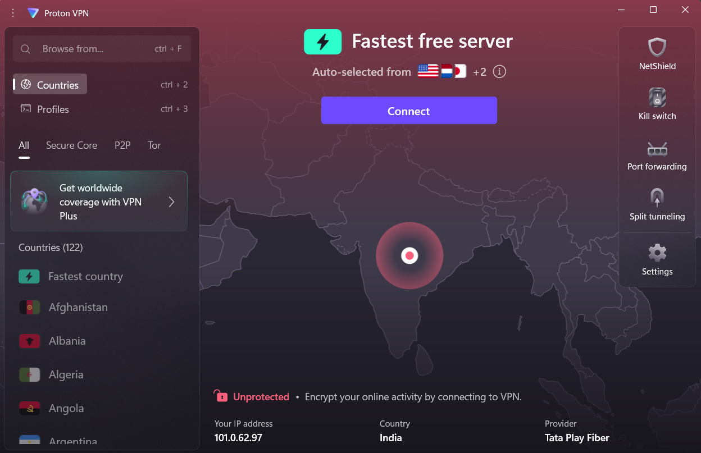
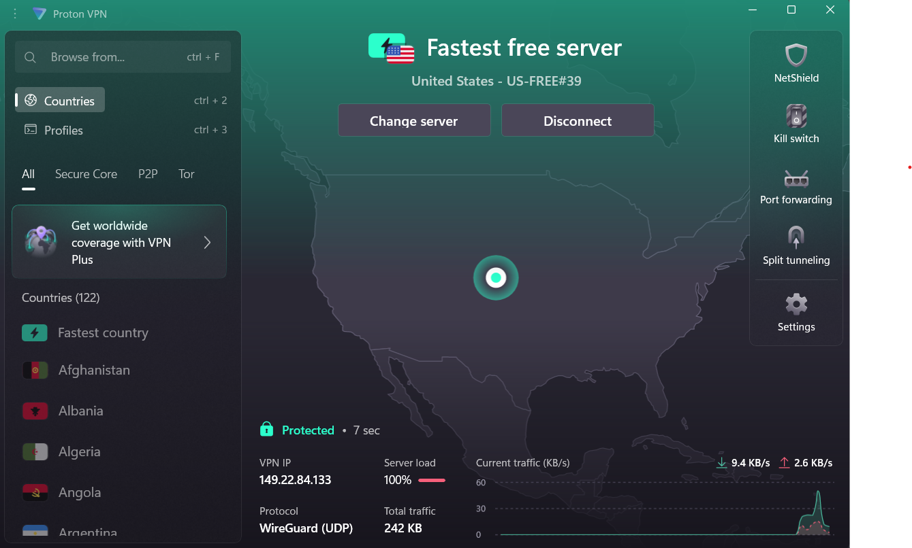
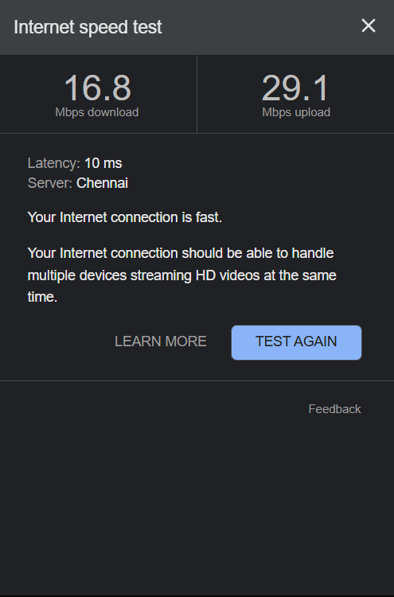
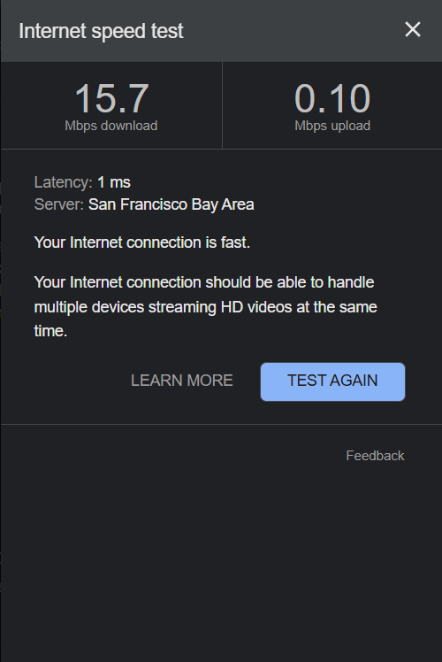
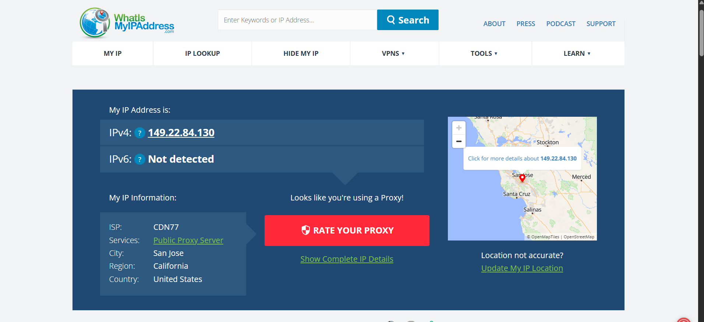

# CyberSecurity_Internship-Elevate_labs-task8
##  Objective

Understand the role of VPNs in protecting privacy and securing communication by setting up a free VPN client, verifying its operation, and analyzing its impact on network speed and IP address.

**Selected VPN:**  **ProtonVPN**

##  VPN Setup Steps

1. **Download and install:**  
   Installed the ProtonVPN client for Windows.

2. **Connect to a VPN server:**  
   Connected to the fastest free server .

3. **Verify IP address change:**  
   Used whatismyipaddress.com and ProtonVPN client to confirm new IP.

4. **Browse and test encryption:**  
   Browsed websites and ran speed tests to confirm encrypted traffic.

5. **Disconnect and compare:**  
   Disconnected VPN to compare changes in speed and IP.

6. **Research VPN features:**  
   Investigated ProtonVPN’s encryption and privacy measures.

---
##  Before vs After: Screenshots & Results

###  Connection Status

| State         | Screenshot      | Description                                     |
|---------------|----------------|-------------------------------------------------|
| **Before VPN**  |  | Not connected, real IP/location visible.        |
| **After VPN**   |   | Connected to USA server, new VPN IP assigned. |

---

###  Network Speed Test

| State         | Screenshot      | Download (Mbps) | Upload (Mbps) | Server Location |
|---------------|----------------|-----------------|--------------|----------------|
| **Before VPN**  |  | 16.8           | 29.1           | Bangalore        |
| **After VPN**   |   | 15.7           | 0.10           | California        |

- **Observation:**  
  VPN connection to a distant server (USA) significantly reduced download/upload speeds due to encryption and routing overhead.

- **Result:**  
  IP address and visible location changed, confirming VPN is masking real identity and encrypting traffic.
  

---

###  Benefits

- **Encrypts all internet traffic**: Protects sensitive data from hackers and ISPs.
- **Masks IP address and location**: Enhances online anonymity.
- **Bypasses geo-restrictions**: Access region-locked content.
- **Public Wi-Fi protection**: Secures data on unsecured networks.

### Limitations

- **Reduced speed**: Notable drop in speed, especially when connected to distant servers.
- **Free tier restrictions**: Limited server choices and features.
- **Not full anonymity**: Cannot prevent all tracking (e.g., browser fingerprinting).
- **Potential compatibility issues**: Some apps or services may block VPN traffic.

---

